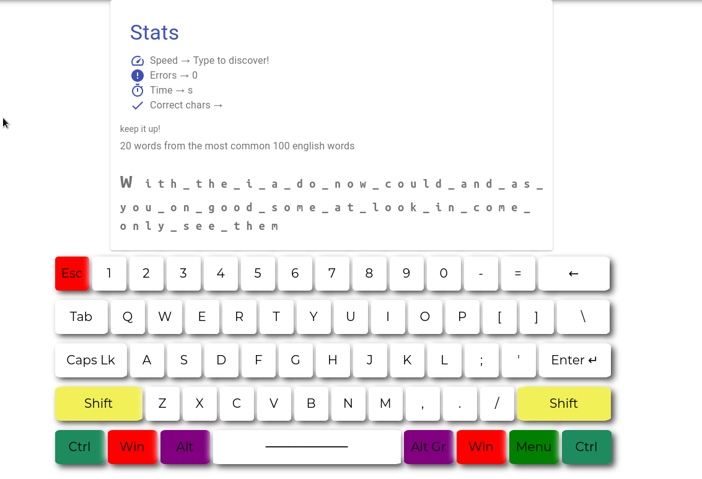

# :keyboard: typify
 [](https://opensource.org/licenses/MIT)
 [![Backend Build Status]](https://github.com/J1M-RYAN/typify/workflows/rust.yml/badge.svg)
A web app to help me practice typing common English words [Live App](https://j1m-ryan.github.io/typify/)  


  
### :computer: Frontend installation

This web app can be ran locally after cloning or downloading the repo.  

To install dependencies after cloning the repo run `yarn install`  

### :electric_plug: Backend installation
To compile the backend you need rust / cargo nightly.
```
rustup toolchain install nightly
rustup default nightly
```
Api Documentation is [here](rust-backend/api_docs.md)

### :keyboard: Full stack usage

To launch the app locally run the bash script `./run_stack.sh`

### :hammer: Built With

- [Rocket](https://rocket.rs/) - The backend

- [React.js](https://reactjs.org/) - The frontend library

- [Material-UI](https://material-ui.com/) - Frontend UI framework

- [Axios](https://github.com/axios/axios) - Http client for the frontend
